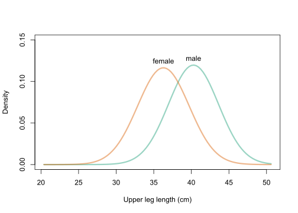

```{r, message = FALSE}
require(magrittr)
require(dplyr)
library(stats4)
```

# Instructions

The final exam will be a 30 minute one-on-one oral exam with the instructor recorded in Zoom. Please prepare solutions to the following is a set of questions. During the oral exam, the instructor will ask a series of questions covering topics from the course and the questions. For example, the instructor may ask:

1. Please explain how you solved a particular question.
1. Please solve a new question (perhaps closely related to a question below).
1. Please explain course topic X.

You will be graded on both the accuracy of your responses and the clarity with which you explain course concepts and solutions to questions.

The final exam should represent your own work.  Do not consult with or collaborate in any way with anyone other than the instructor.

Prior to meeting with the instructor, you should:

   + Create a folder in your Probability and Inference Portfolio; call it `99-final-exam`.
   + Compile, save, and push your solutions to your GitHub repository

# 1. Simulation

The Monte Hall problem is a classic game show.  Contestants on the show where shown three doors.  Behind one randomly selected door was a sportscar; behind the other doors were goats.

At the start of the game, contestants would select a door, say door A.  Then, the host would open either door B or C to reveal a goat.  At that point in the game, the host would ask the contestant if she would like to change her door selection.  Once a contestant decided to stay or change, the host would open the choosen door to reveal the game prize, either a goat or a car.

In this problem, consider a **modified** version of the Monte Hall problem in which the number of doors is **variable**.  Rather than 3 doors, consider a game with 4 or 5 or 50 doors.  In the modified version of the game, a contestant would select an initial door, say door A.  Then, the host would open **one** of the remaining doors to reveal a goat.  At that point in the game, the host would ask the contestant if she would like to change her door selection.  Once a contestant decided to stay or change, the host would open the choosen door to reveal the game prize, either a goat or a car.

Consider two strategies:
  
  1. Always stay with the first door selected.
  2. Always switch to the unopened door.

**C.** The function `game` below plays a single game of Monte Hall.  The function returns a vector of length two, the first element is the prize under strategy 1 and the second element is the prize under strategy 2.  The function has a single input parameter, N, which is the number of doors in the game.

Use the `game` function to estimate the probability that both strategies result in a goat. Let **N=4**.

```{r}
game <- function(N){
  if(N<3) stop("Must have at least 3 doors")
  prize <- sample(c(rep("goat",N-1),"car"), N)
  guess <- sample(1:N,1)
  game <- data.frame(door = 1:N, prize = prize, stringsAsFactors = FALSE) %>% 
    mutate(first_guess = case_when(
      door == guess ~ 1
      , TRUE ~ 0
    )) %>% 
    mutate(potential_reveal = case_when(
        first_guess == 1 ~ 0
      , prize == "car" ~ 0
      , TRUE ~ 1
    )) %>% 
    mutate(reveal = 1*(rank(potential_reveal, ties.method = "random") == 3)) %>% 
    mutate(potential_switch = case_when(
      first_guess == 1 ~ 0
      , reveal == 1 ~ 0
      , TRUE ~ 1
    )) %>% 
    mutate(switch = 1*(rank(potential_switch, ties.method = "random") == 3))
  c(game$prize[game$first_guess == 1], game$prize[game$switch == 1])
}
```

To estimate the probability that each strategy results in a goat, I did a simulation of the game and found the result of each game for each strategy using the `game()` function above. I saved each outcome in a vector and converted each success (result being a goat) to a 1 and failure (a car) to 0. Then took the mean of each vector which is the same as the probability of success since it is summing all the ones over the total number of games in the vector. 

```{r, cache = TRUE}
R <- 5000
strategy1 <- NA
strategy2 <- NA
for (i in 1:R){
  strategy1[i]  <- game(4)[1]
  strategy2[i] <- game(4)[2]
}

s1 <- ifelse(strategy1 == "goat", 1, 0)
s2 <- ifelse(strategy2 == "goat", 1, 0)

#prob first strategy
mean(s1)

#prob second strategy
mean(s2)
```

The probability that strategy 1 results in a goat is 0.75 and the probability that strategy 2 results in a goat is 0.64. The question is asking what is the probability they both result in a goat which means P(goat|Strategy1)*P(goat|Strategy2). This is an AND probability problem so I should multiply the two resulting probabilities together.

```{r}
p <- mean(s1)*mean(s2)
p
```
The probability that both strategies result in a goat is 0.48.

**B**. Continuing from part **C**, what is the probability that at least one of the strategies results in winning a car?

I took my results from the simulation above and converted them into a vector of 1's and 0's where this time the result of a car was a 1 for a success. Then again, I took the mean of each strategy to find the probability of resulting in a car in each case. To find the probability that at least one of the strategies results in winning a car I have to add together the probability of each strategy separately and subtract the instances in which they both result in a car to not double count. This is the formula for this process:

$P(s1=car OR s2=car) = P(s1=car) + P(s2=car) - P(s1=car AND s2=car)$

Another way to solve the problem is to take the total probability (which is always 1) and subtract the probability that neither strategy results in winning a car. This can be done using the probabilities of resulting in a goat from the question above, multiplying and subtracting the result from 1.

$1 - P(s1 = goat)P(s2 = goat) = P(car >= 1)$

```{r, cache = TRUE}
car1 <- ifelse(strategy1 == "car", 1, 0)
car2 <- ifelse(strategy2 == "car", 1, 0)

#prob first strategy
p1 <- mean(car1)

#prob second strategy
p2 <- mean(car2)

#prob at least one is car
p1 + p2 - p1*p2

#another way to do it
1 - mean(s1)*mean(s2)
```

The probability that at least one of the strategies will result in winning a car is 0.52 with either calculation route. 

**A**. Communicate the precision of your simulated probability in part **B** by calculating a **99\%** confidence interval.

I took what I did in part C and B and combined them into a function that spits out the probability that as least one of the strategies will result in winning a car. I then replicated this function many times to find the estimated probability in each case. I then took the 99% confidence interval from the sampling distribution of probabilities. 

```{r, cache = TRUE}
set.seed(5432)
# Using simulation
monty_hall_sim <- function(N){
  strategy1 <- NA
  strategy2 <- NA
  for (i in 1:N){
    strategy1[i]  <- game(4)[1]
    strategy2[i] <- game(4)[2]
  }
  s1 <- ifelse(strategy1 == "goat", 1, 0)
  s2 <- ifelse(strategy2 == "goat", 1, 0)

  1 - mean(s1)*mean(s2)
}

R <- 500
results <- NA
for (i in 1:R){
  results[i] <- monty_hall_sim(100)
}

hist(results, freq = FALSE, breaks = 100)
```


```{r}
quantile(results, c(0.01/2, 1 - 0.01/2))
```

The 99% confidence interval for the probability that as least one of the strategies will result in winning a car is from 0.415-0.639.

# 2. Probability

Consider a test for a rare genetic condition.  Let T+ denote a test result that indicates the condition is present, while T- denotes absence.  Let D+ and D- denote the true status of the disease.

**C**.  Fill-in the probability table using the following information:

+ P(T+|D+) = .85,  and 
+ P(T-|D-) = .95,  and 
+ P(D+) = 0.001

According to Bayes Rule:

$P(T+|D+) = \frac{P(T+)P(D+|T+)}{P(D+)}$

Calculations:

|    |          D+        |             D-           |         |
|:--:|:------------------:|:------------------------:|:-------:|
| T+ | 0.85*0.001         | (1-0.001) - 0.95(1-0.001)| 0.05075 |
| T- | 0.001-(0.85*0.001) | 0.95(1-0.001)            | 0.94915 |
|    | 0.001              | 1 - 0.001                | 1       |

Final result:

|    | D+      | D-     |         |
|:--:|:-------:|:------:|:-------:|
| T+ | 0.00085 | 0.0499 | 0.05075 |
| T- | 0.00015 | 0.949  | 0.94915 |
|    | 0.001   | 0.999  | 1       |

**B**. Calculate the **negative** predictive value of the test, P(D-|T-).

P(D-|T-) is the conditional column probability. Filling out the above table for conditional row and column probabilities we get the following:

|    | D+      | D-     |         |        |
|:--:|:-------:|:------:|:-------:|:------:|
|    | 0.0167  |  0.98  |         | row    |
| T+ | 0.00085 | 0.0499 | 0.05075 | cell   |
|    |  0.85   | 0.0499 |         | column |
|----|---------|--------|---------|--------|
|    | 0.00016 |  0.999 |         | row    |
| T- | 0.00015 |  0.949 | 0.94915 | cell   |
|    |  0.15   |  0.95  |         | column |
|----|---------|--------|---------|--------|   
|    | 0.001   | 0.999  |    1    |        |

$P(D-|T-) = \frac{P(D-)P(T-|D-)}{P(T-)}= 0.999$

**A** Create a plot that shows how the **positive** predictive value as a function of the prevalence of disease, P(D+).

The positive predictive value is P(D+|T+) which is equal to 0.0167 given that P(D+) = 0.001

I will take a sequence of P(D+) and find P(D+|T+) each time and plot to results. 

In this case $P(D+|T+) = \frac{(0.85xP(D+))}{((0.85xP(D+))+(1-P(D+))-0.95x(1-P(D+)))}$

```{r, eval = FALSE}
prevalence <- seq(0.001, 0.1, length = 50)
ppv <- (0.85*prevalence)/((0.85*prevalence)+(1-prevalence)-0.95*(1-prevalence))
plot(prevalence, ppv, xlab = "Prevalence", ylab = "PPV")
```

As the prevalence of the disease increases, the positive predictive value of the disease also increases by quite a bit. This means with a small increase in the prevalence of the rare genetic condition, the chances that an individual has the disease after testing positive increases quite a bit.

# 3. Discrete Distributions

Suppose the yearly hospital charges (in thousands of dollars) for a randomly selected Vanderbilt student is a mixture distribution.

For 50% of students, the hospital charges will be $0.  For the remaining 50% of students, the hospital charges are a random variable described by a gamma distribution with shape = 2 and scale = 2.  (Again, in thousands of dollars.)   

```{r}
hospital_charges <- function(N){
  group <- rbinom(N, 1, 0.5)
  charges <- 0*group + rgamma(N, shape = 2, scale = 2)*(1-group)
  charges
}
```

**C**.  What is the 90th percentile for yearly hospital charges for a randomly selected Vanderbilt student?

To answer this question I need to know what the 90th percentile of yearly hospital charges is for the population. I can use simulation to calculate the sampling distribution of the 90th percentile by calculating a large number of replicates of sample distributions and finding the 90th percentile in each instance using the quantile function. I chose a sample size of 3,000 because as the sample size gets larger, the 90th percentile will get closer to the population's 90th percentile.  

```{r, cache = TRUE}
set.seed(8374)
R <- 5000
ninty <- rep(NA, R)
for (i in 1:R){
  charges <- hospital_charges(3000)
  ninty[i] <- quantile(charges, .9)
}

hist(ninty, freq = FALSE, breaks = 100)
abline(v = mean(ninty), col = "blue", lwd = 2)
```

```{r}
mean(ninty)
```

I estimated the 90th percentile for yearly hospital charges for a randomly selected Vanderbilt student is $5,984. This means that the probability the student pays less than \$5,984 in hospital charges is .9. 

**B**.  Consider the **class** average yearly hospital charge for the students in a class of size 30.  Plot the density function or a simulated histogram of the class average yearly hospital charge.

To find the sampling distribution of the average (or mean) yearly hospital charge, I have to simulate many replicates of distributions of charges for a class size of 30 and take the mean each time. This gives me the sampling distribution of class average yearly hospital charges which I can plot using the `hist` function. 

```{r, cach = TRUE}
class_charges <- NA
for (i in 1:5000){
  class_charges[i] <- mean(hospital_charges(30))
}

hist(class_charges, freq = FALSE, breaks = 50, xlab = "Hopsital Charges (in thousands)")
```

It looks like the sampling distribution for the average yearly hospital charges for a class size of 30 is normally distributed around the mean of about $2,000. 

**A**.  What is the probability that a randomly selected class of size 30 students will have less than 10 students with zero yearly hospital charges?

To answer this question I used simulation and calculated in each replicate whether less than 10 students had a zero yearly hospital charge in each sample of 30 students. I then took the proportion of those "successes" over the total number of simulations performed to find the approximate probability.

```{r, cache = TRUE}
set.seed(9238543)
zero_charges <- NA
for (i in 1:10000) {
  sample <- hospital_charges(30)
  sample <- ifelse(sample == 0, 1, 0)
  if (sum(sample) < 10) {
    zero_charges[i] <- 1
  } else {
    zero_charges[i] <- 0
  }
}
mean(zero_charges)

```

The probability less than 10 of the 30 students will have zero yearly hospital charges is about 0.02.

# 4. Continuous Distributions

**C.** Suppose diastolic blood pressure (DBP) follows a normal distribution with mean 80 mmHg and SD 15 mmHg. What is the probability that a randomly sampled person’s DBP lies between 70 and 104 mmHg?

We know the population of diastolic blood pressure (DBP) follows N(80,15) so we can just use the `pnorm` function to find the probability DBP is under 70 subtracted from the probability DBP is under 104 to get the range in between those two values.

```{r}
curve(dnorm(x, mean = 80, sd = 15), from = 150)
```

```{r}
p <- pnorm(104,mean = 80, sd = 15) - pnorm(70,mean = 80, sd = 15)
p
```

The probability that a randomly sampled person's DBP lies between 70 and 104 mmHg is 0.69.

**B.** Suppose a human femur was discovered that is 37 cm long.  Also suppose that using the NHANES data, researchers believe the distribution of femor bones, by sex, are distributed as follows:

+ Female adult femor $\sim N(36, 3.3)$
+ Male adult femor $\sim N(40, 3.4)$



Under the assumption that male and females are equally likely, what is the probability that the discovered femor was from a male?

I need to calculate P(male|FL = 37). I know P(male) = 0.5, P(female) = 0.5 and 
can use the above distributions to calculate f(FL|male) and f(FL|female).

Then I can use Bayes Rule as follows:

$P(male|FL = 37) = \frac{f_{FL|male}(37)P(G = male)}{f_{FL|male}(37)P(G = male) + f_{FL|female}(37)P(G = female)}$

$P(male|FL = 37) = \frac{dnorm(37, 40, 3.4)*0.5}{dnorm(37, 40, 3.4)*0.5 + dnorm(37, 36, 3.3)*0.5}$

$P(male|FL = 37) = 0.4078$

Here femur length is continuous so I plugged in the density for femur length into the equation. 

```{r}
F_fl37 <- dnorm(37, mean = 36, sd = 3.3)

M_fl37 <- dnorm(37, mean = 40, sd = 3.4)

p <- (dnorm(37, mean = 40, sd = 3.4)*0.5)/((dnorm(37, mean = 40, sd = 3.4)*0.5) + dnorm(37, mean = 36, sd = 3.3)*0.5)

p
```

**A.**  Continuing part **B**, generate a plot of P(femor from male | femor length = x).  Let femor length range from 25 to 50.

```{r}
femur_length <- 25:50
prob_male <- 0.5*dnorm(femur_length, mean = 40, sd = 3.4)/(0.5*dnorm(femur_length, mean = 40, sd = 3.4) + 0.5*dnorm(femur_length, mean = 36, sd = 3.3))
plot.new()
plot.window(xlim = c(25,50), ylim = c(0,1))
lines(femur_length, prob_male)
axis(1)
axis(2)
box()
title(xlab = "Femor Length", ylab = "P( Male | femor length)")
```

I can see from the plot, that as the femur length increases the probability that the individual is male also increases. This makes sense given the distribution of male femurs had a higher mean than females. 

# 5. Expectation and Variance

Let us revisit the yearly hospital charges distribution from a previous section.

>**Recall:** The yearly hospital charges (in thousands of dollars) for a randomly selected Vanderbilt student is a mixture distribution. For 50% of students, the hospital charges will be $0.  For the remaining 50% of students, the hospital charges are a random variable described by a gamma distribution with shape = 2 and scale = 2.  (Again, in thousands of dollars.)   

```{r}
set.seed(543)
hospital_charges <- function(N){
  group <- rbinom(N, 1, 0.5)
  charges <- 0*group + rgamma(N, shape = 2, scale = 2)*(1-group)
  charges
}

#create large sample distribution
sample_charges <- hospital_charges(100000)

#plot distribution of sample
hist(sample_charges, freq = FALSE, breaks = 50)
```

**C.** What is E[yearly hospital charges]?

I can calculate the expected value analytically or through using simulation.

Because we know that as the sample size goes towards infinity, the sample statistics converge to the population parameters. Using the large sample I created above, I can estimate the expected value.

```{r}
mean(sample_charges)
```

But I can get an even better simulated estimation by taking many replicates of estimated samples and taking the average expected value found from all the simulated samples.

```{r}
set.seed(52093)
EV <- NA
for (i in 1:5000){
  EV[i] <- mean(hospital_charges(3000))
}

mean(EV)
```

Using simulation I found the expected value to be 2. Even further, I can calculated the expected value analytically by adding together the expected value from both distributions since we know how many students come from each distribution (half from each).

In this case,

$D = U + V$ therefore $E[D] = E[U] + E[V]$

I know the expected value of the first distribution as all values are 0 so the expected value is 0.

The expected value of a gamma distribution is calculated as follows:
$E[X] = shape*scale$

so plugging the given gamma distribution I get
$E[X] = 2*2 = 4$

```{r}
EV <- 0*0.5 + 2*2*0.5
EV
```

Therefore the expected value of yearly hospital charges is $2,000.

**B.** Suppose Vanderbilt implements a cap of \$10,000 on yearly student hospital charges.  What is the mean yearly hospital charge under the new policy?

To solve this problem I can use the same given function above to calculate a distribution of student hospital charges. Then for every charge above $10,000, I changed the value to 10 and again took the mean of the new capped distribution. If I simulate this over  many replicates and take the average overall mean of yearly hospital charges, I can get the mean yearly hospital charge under the new policy.

```{r}
set.seed(432)
means <- NA
R <- 5000
for (i in 1:R){
  sample <- hospital_charges(3000)
  capped_sample <- ifelse(sample > 10, 10, sample)
  means[i] <- mean(capped_sample)
}

mean(means)
```

The estimated mean yearly hospital charge under the new policy of capping charges at $10,000, is \$1,952.

**A.** What is the variance of yearly hospital charge under the new policy?

Again I can perform a similar simulation but instead calculate the variance in each simulated sample. 

```{r}
set.seed(286)
variance <- NA
R <- 5000
for (i in 1:R){
  sample <- hospital_charges(3000)
  capped_sample <- ifelse(sample > 10, 10, sample)
  variance[i] <- var(capped_sample)
}

mean(variance)
```

Under the new capped policy the variance is 7.03 ($7,030). As the variance is a measure of spread, this distribution has a large spread of values. It is a pretty large variance considering the expected value of 1.95, but it makes sense in this mixture distribution because typically students will either have \$0 in hospital charges or a larger bill. 

# 6. Transformations & Sampling Distributions

**C.** Consider the log normal distribution.  If X is a log normal random variable, then log(X) is a normal random variable.  One way to create pseudo-random draws from the log normal distribution is to generate draws from a normal distribution and then to transform the draws by exponentiating.  The parameters of the log normal distribution are the parameters of the underlying normal distribution, $\mu$ and $\sigma$ (or $\sigma^2$).  

Log normal data are prevalent is biological systems and econometrics.

Suppose a blood chemistry measure has a log normal distribution with $\mu$ = 0 and $\sigma$ = 1. Generate a histogram or density curve for the sampling distribution of the median when the sample size is 101.

```{r}
#lognormal distribution
x <- rlnorm(101, 0, 1)

#highly skewed - nature of the distribution
hist(x, freq = FALSE, breaks = 50)
plot(ecdf(x))

medians <- NA
for (i in 1:5000){
  sample <- rlnorm(101, 0, 1)
  medians[i] <- median(sample)
}

hist(medians, freq = FALSE, breaks = 50)
```

I used simulation to find the median of 5,000 random samples of the log normal distribution with a sample size of 101, a mean of 0 and a standard deviation of 1. The sampling distribution of medians is normally distributed with a mean of approximately 1.

**B.** Below is the CDF function for the kth order statistic when the underlying distribution is log normal with $\mu$ = 0 and $\sigma$ = 1.  Create a plot of the ECDF of the simulated sampling distribution generated in **C** and overlay the CDF using the function below.

```{r}
Fk <- function(x,k,n){
  pbinom(k-1, n, plnorm(x), lower.tail = FALSE)
}

plot(ecdf(medians))
curve(
  Fk(x, n = 101, k = 51), 0.6, 1.6,
  xlab = parse(text="X[(50)]"),
  ylab = "Probability",
  main = "CDF of Median Order Statistic of the Log Normal Distribution",
  add = TRUE,
  col = "blue",
  lwd = 2
)
```

I created a plot of the eCDF of the sampling distribution of medians simply by using the `ecdf` function. Then, I plotted the curve of the 51st order statistic of the sample size 101. In this case the 51st order statistic is the median because the sample size is 101 so there are half the values below 51 and half the values above 51. As we can see, the eCDF and CDF are extremely close meaning our estimated sampling distribution is pretty accurate.

**A.** Of the 25th, 50th, and 75th quantiles of the distribution from **B**, which will have the tightest 95% CI?  (Show the sampling distribution of each.)

The 25th quantile is the 26th order statistic, the 50th quantile is the 51st order statistic and the 75th quantile is the 76th order statistic. I used simulation to find the sampling distribution of the 25th, 50th and 75th quantiles for the log normal distribution. Since I know it is a log normal distribution with a mean of 0 and a standard deviation of 1, I can use the `rlnorm` command to create replicates of random samples and take each quantile desired in each instance. I then plotted a histogram of the quantile sampling distribution for each statistic and calculated a 95% confidence interval.

```{r}
#simulation
first_q <- NA
med <- NA
last_q <- NA
for (i in 1:5000){
  sample <- rlnorm(101, 0, 1)
  first_q[i] <- quantile(sample, 0.25)
  med[i] <- quantile(sample, 0.5)
  last_q[i] <- quantile(sample, 0.75)
}
```

```{r}
#25th
hist(first_q, freq = FALSE, breaks = 100)
quantile(first_q, c(0.05/2, 1 - 0.05/2))
```

The confidence interval for 25th quantile of the log normal distribution is 0.39-0.67.

```{r}
#50th
hist(med, freq = FALSE, breaks = 100)
quantile(med, c(0.05/2, 1 - 0.05/2))
```

The confidence interval for the 50th quantile of the log normal distribution is 0.77-1.26.

```{r}
#75th
hist(last_q, freq = FALSE, breaks = 100)
quantile(last_q, c(0.05/2, 1 - 0.05/2))
```

The confidence interval for the 75th quantile of the log normal distribution is 1.50-2.52.

```{r}
curve(dlnorm(x,0,1), 0, 5)
```

The tightest confidence interval is for the 25th quantile, follwed by the 50th and lastly the 75th. This makes sense because looking at the distribution of the log normal distribution above with a mean of 0 and standard deviation of 1, we can see that the highest density of values happen between 1 and 0 towards the beginning of the distribution. This means the first 25% of the data has less variance and is much closer in values making a prediction of the 25th quantile easier to predict or more precise hence a smaller confidence interval.

# 7. Estimation of CDF and PDF from data

The following code will load the NHANES data and select the first 500 rows.

```{r}
Hmisc::getHdata(nhgh)
d1 <- nhgh[1:500,]
```

**C.** Estimate the distribution of standing height for adult (age > 18) males using the MLE method with a normal distribution.  Create a plot of the estimated density function.

First I filtered for adult male heights in the data set. Then I created a likelihood function for the normal distribution. I plugged this likelihood function into the `mle` function with an estimated mean of 170 and an estimated standard deviation of 5. Here I am trying to find the best mean and standard deviation parameters to find a distribution that maximizes the density or likelihood of the data distribution. In this method, the data is fixed and the parameters are variable and varied until the best distribution is found to fit the data.

```{r}
heights <- nhgh %>% filter(sex == "male") %>% 
  filter(age > 18) %>% 
  pull(ht)

nLL <- function(mean, sd){
  fs <- dnorm(
    x = heights,
    mean = mean, 
    sd = sd,
    log = TRUE
    )
    -sum(fs)
}

#does search starting with a guess of 170 and 5
param_hat <- mle(nLL,
    start = list(mean = 170, sd = 5),
     method = "L-BFGS-B",
    #lower bound for height is 0
    lower = c(0, 0.01)
    )

hist(heights, breaks = 100, freq = FALSE,main = "Height of Adult Males using MLE", xlab = "Height")
curve(dnorm(x, mean = coef(param_hat)[1], 
            sd = coef(param_hat)[2]), 
            col = "red", 
            lwd = 6,
            add = TRUE)
```

The estimated distribution using MLE, is a normal distribution with a mean of 174.5 and a standard deviation of 7.88. This estimation looks like a pretty good fit according to the density within the data and the estimated density function.

**B.** Estimate the distribution of BMI for adult (age > 18) females using using the method of moment method with the gamma distribution. Create a plot of the estimated density function.

First I filtered for adult female bmi in the data set. Method of Moments is a process in which we calculate the moments for a specific distribution and use a system of equations to solve for the specific distribution parameters. The process for MM is as follows:
  
1. Examine your data and:
    i) Choose parametric distribution 
    ii) Identify the distribution parameters
2. Calculate/find distribution moments (need as many moments as distribution parameters) or
3. Create a system of equations equating distribution moments to sample moments
4. Solve system of equations for distribution parameters

Here I am using the gamma distribution which is described by the parameters shape and scale.
Since there are two parameters to estimate, I will need the first two moments which are E[X] and V[X] and are calculated for the gamma distribution as follows.

  $E[X] = shape*scale = \bar{X}$

  $V[X] = shape*scale^2 = s^2$

Using these as a system of equations equating distribution moments to sample moments, I get

$shape = \frac{\bar{X}}{scale}$

substituting we get $\frac{\bar{X}}{scale} * scale^2 = s^2$

therefore $scale = \frac{s^2}{\bar{X}}$

and $shape = \frac{\bar{X}^2}{s^2}$

```{r}
bmi <- nhgh %>% filter(sex == "female") %>% 
  filter(age > 18) %>% 
  pull(bmi)

#E[X] and V[X]
xbar <- mean(bmi)
s2 <- var(bmi)

shape_hat <- xbar^2/s2
scale_hat <- s2/xbar

shape_hat
scale_hat
```

I used the `mean` and `var` functions to estimate the shape and scale. The estimated shape is 14.83 and the estimated scale is 1.98. I will overlay the estimated PDF onto the histogram of bmi to visualize if the estimated distribution fits the data well. 

```{r}
hist(bmi, breaks = 100, freq = FALSE,main = "BMI of Adult Females using MM", xlab = "BMI")
curve(dgamma(x, shape = shape_hat, 
            scale = scale_hat), 
            col = "red", 
            lwd = 6,
            add = TRUE)
```

The estimated distribution using MM, is a gamma distribution with a shape of 14.83 and a scale of 1.98. This estimation looks like a pretty good fit according to the density within the data and the estimated density function.

**A.** Estimate the distribution of creatinine (SCr) for adults (age > 18) using the kernel density method with a gaussian kernel.  Create a plot of the estimated density function.

```{r}
scr <- nhgh %>% 
  filter(age > 18, !is.na(SCr)) %>% 
  pull(SCr)

hist(scr, freq = FALSE, breaks = 250, xlim = c(0, 2.5), ylim = c(0, 2),
     main = "PDF: Creatinine of Adults using Kernel Density", xlab = "Creatinine")
#adjust smoothness 
lines(density(scr, adjust = 1.25, kernel = "gaussian"), col = "blue", lwd = 2)
```

Here is a plot of the kernel density estimate along with a histogram of the underlying data. We can see the estimate is a good fit and here I used 1.25 as the adjustment of the smoothness tuning parameter. 

```{r}
ecdfstar <- function(t, data, smooth){
  outer(t, data, function(a,b){pnorm(a,b,smooth)}) %>% rowMeans
}
plot(ecdf(scr), main = "CDF: Creatinine of Adults using Kernel Density",xlab = "Creatinine")
curve(ecdfstar(x,scr, smooth = 0), add = TRUE, lwd = 3, col = "blue")
```

Here is an estimate of the CDF using kernel density estimation. The smoothness parameter here is 0 and it seems to fit the distribution well. Here I am replacing the step function with a smooth, continuous kernel function.

# 8. Sample from an estimated distribution

The following code will load the low birth weight data from the MASS package.  The description of the variables in the dataset can be found in the birthwt documentation with the command `?MASS::birthwt`.

```{r}
bwt <- MASS::birthwt
```

**C.** Generate a 95% confidence interval for the mean birthweight of infants whose mothers **did** smoke during pregnancy using the bootstrap.

First I want to filter for birth weight of only infants whose mothers smoked during pregnancy. This is a sample of 74 infant birth weights. 

To use bootstrapping, I will create new samples of size 74 by sampling rows of my sample data with replacement. Then I can calculate the mean for each bootsrap replicate. I can then generate a bootstrap sampling distribution of means. From this distribution I can chop off the first and last 2.5% of the data to get the middle 95%. 

```{r, cache = TRUE}
bwt_smoke <- bwt %>% filter(smoke == 1) %>% select(bwt)
bwt_s <- bwt_smoke$bwt
n_bwt <- length(bwt)
R <- 5000
out <- rep(NA, R)
for (i in 1:R){
  index <- sample.int(n_bwt, n_bwt, replace = TRUE)
  out[i] <- bwt_s[index] %>% mean
}

par(mfrow = c(1,2))
plot(ecdf(out), lwd = 3, main = "ECDF")
hist(
    out
  , main = "EPDF"
  , ylab = "Density"
  , xlab = "Bootstrap Means"
  , breaks = 25
  , freq = FALSE
  , border = "white"
  , col = "gray50"
)
box()

conf_95 <- quantile(out, c(0.05/2, 1 - 0.05/2))
conf_95
```

The 95% confidence interval for the mean birth weight of infants who mother's smoked during pregnancy using bootstrapping is 2647.4 - 2778.5 grams. 

**B.** Generate a 95% confidence interval for the mean birth weight of infants whose mothers **did** smoke during pregnancy using the Central Limit Theorem shortcut.

Because this data

```{r}
t1 <- t.test(bwt_s)
t1
```

Using the Central Limit Theorem shortcut, I found the 95% confidence interval for mean birth weight of infants whose mothers smoked during pregnancy is 2619.1 - 2924.7 grams. 

**A.** Let $\mu_s$ be the mean birth weight of infants whose mothers smoked during pregnancy.  Let $\mu_{ns}$ be the mean for the non-smoking group.  Use simulation to calculate the 95% confidence interval for $\mu_s/\mu_{ns}$.

```{r}
#smoked
bwt_smoke <- bwt %>% filter(smoke == 1) %>% select(bwt)
bwt_s <- bwt_smoke$bwt

#didn't smoke
bwt_non <- bwt %>% filter(smoke == 0) %>% select(bwt)
bwt_n <- bwt_non$bwt

#distribution smokers
hist(bwt_s, freq = FALSE, breaks = 20)

#distribution non-smokers
hist(bwt_n, freq = FALSE, breaks = 20)

#smokers estimates
mean_mle_smoke <- mean(bwt_s, na.rm = TRUE)
sd_mle_smoke <- sd(bwt_s, na.rm = TRUE)

#non-smoker estimates
mean_mle_non <- mean(bwt_n, na.rm = TRUE)
sd_mle_non <- sd(bwt_n, na.rm = TRUE)

#num replicates
R <- 5000
mean_prop <- rep(NA, R)

for(i in 1:R){
  sample_smoke <- rnorm(length(bwt_s), mean = mean_mle_smoke, sd = sd_mle_smoke)
  sample_non <- rnorm(length(bwt_n), mean = mean_mle_non, sd = sd_mle_non)
  mean_prop[i] <- mean(sample_smoke)/mean(sample_non)
}

alpha <- 0.05
conf <- quantile(mean_prop, c(alpha/2, 1-alpha/2))
conf
```

The 95% confidence interval for $\mu_s/\mu_{ns}$ is 0.85 - 0.97. 

# 9.  Inference

**C.** Suppose two studies were performed looking at the risk of mild complication after hernia repair using open and laparoscopic surgical approaches.  The study results are below.  Using the data from each study individually, perform the hypothesis test that the risk of complication between open and laparoscopic repairs are the same under the usual point null. What is the p-value from each study?  What do you conclude from each study?

| Study 1 | Comp | No comp | Sample Total |
|:-------:|:-----|:-------:|:------------:|
|   Open  |  30  |    70   |     100      |
|   Lap   |  35  |    65   |     100      |

| Study 2 | Comp | No comp | Sample Total |
|:-------:|:-----|:-------:|:------------:|
|   Open  |  600 |  1400   |     2000     |
|   Lap   |  619 |  1381   |     2000     |

In this instance we are using proportions, which are like an average in that we can use the Central Limit Theorem shortcut. 

**Study 1**
Ho: Proportion of mild complications from the open surgical approach equals the proportion of mild complications from the lapraroscopic surgical approach. 
(Open Comp/Open Total = Lap Comp/Lap Total)

Ha: Proportion of mild complications from the open surgical approach does not equal the proportion of mild complications from the lapraroscopic surgical approach. 
(Open Comp/Open Total != Lap Comp/Lap Total)

```{r}
prop.test(x = c(30,35), n = c(100,100))
```
The p-value for the first study is 0.5459, meaning I fail to reject the null hypothesis and the results are inconclusive. 

**Study 2**

Ho: Proportion of mild complications from the open surgical approach equals the proportion of mild complications from the lapraroscopic surgical approach. 
(Open Comp/Open Total = Lap Comp/Lap Total)

Ha: Proportion of mild complications from the open surgical approach does not equal the proportion of mild complications from the lapraroscopic surgical approach. 
(Open Comp/Open Total != Lap Comp/Lap Total)

```{r}
prop.test(x = c(600,619), n = c(2000,2000))
```
The p-value for the second study is 0.5364, meaning I fail to reject the null hypothesis and the results are inconclusive. 

**B.** Suppose that prior to the studies, the researchers established an equivalence threshold of 6 percentage points.  Using the confidence intervals, which studies (if any) showed a conclusive similarity between surgical approaches for the complication rate.  Explain why.

The confidence interval from the first study is -0.19 to 0.09.
The confidence interval from the second study is -0.04 to 0.02.

An equivalence threshold of 6 percent means that the null region is from -0.06 to 0.06 so if either confidence interval is fully within this region it is a conclusive similarity. The first study does not fall within the region and is inconclusive, but the second study has a confidence interval completely within the null region meaning there is a conclusive similarity between surgical approaches for the complication rate.

**A.** If the data from the studies were combined, what is the smallest equivalence threshold that would identify a conclusive similarity between the surgical approaches?

| Combined | Comp | No comp | Sample Total |
|:--------:|:-----|:-------:|:------------:|
|   Open   |  630  |  1470  |    2100      |
|   Lap    |  654  |  1446  |    2100      |

```{r}
prop.test(x = c(630,654), n = c(2000,2000))
```

The 95% confidence interval for the combined studies is from -0.041 to 0.017. In this instance the equivalence threshold would need to be larger than 0.017 on the right and smaller than -0.041 on the left. In this case the smallest equivalence would be about 4.2%. 

# 10.  Joint Distributions

**C.** Fill in the blank.  The sample correlation is a measure of ____linear______ association.

The correlation is a standardized measure of linear association (-1, 1).

The covariance is a measure of linear association (-inf, inf).

Values closer to zero mean there is not a close association between two variables and large values mean there is a closer association between two variables.

**B.** Explain why predictions from a conditional distribution generally have smaller prediction error than predictions from the marginal distribution.

A conditional distribution is a tighter distribution than a marginal distribution because some information is given, meaning there is less room for error in estimating sample statistics. There is a greater average prediction error for marginal distributions because they tend to have more variance meaning more room for error in estimation. 

**A.** Use the CLT shortcut to calculate the 95% confidence interval for the correlation of arm circumference and arm length using the NHANES dataset.  Is the sample correlation a reasonable measure of association for this data?

```{r}
cor.test(nhgh$armc, nhgh$arml)
```
The 95% confidence interval for the correlation of arm circumference and arm length is 0.48 to 0.52. 

```{r}
plot(nhgh$armc, nhgh$arml)
```

The sample correlation is a reasonable measure of association for arm circumference and arm length because these two variables have a linear relationship. As we can see in the plot, as either arm length or arm circumference increases so does the other, with of course exceptions and room for error. We can use correlation as a good measure of association in this instance because correlation measure linear association and these two variables are linearly related. 
